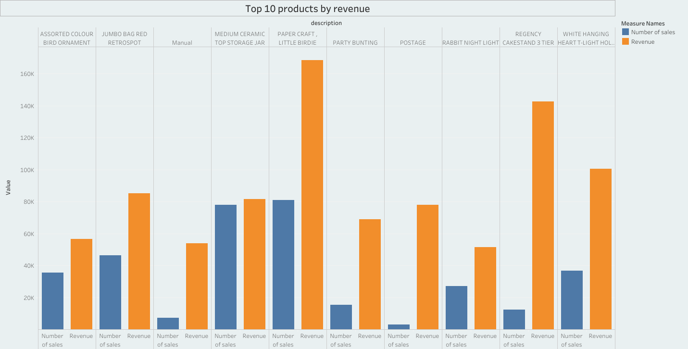
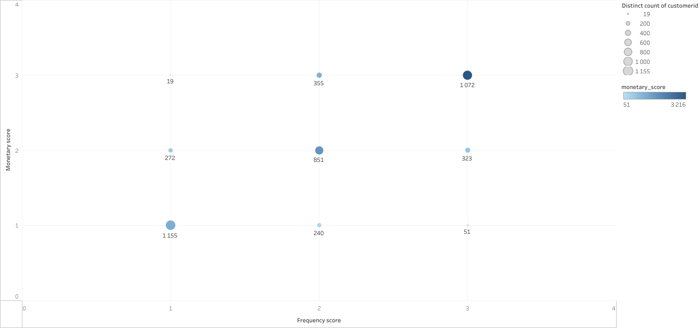

# SQL Project: E-commerce Data Analysis

Аналіз e-commerce датасету **суто SQL-ом**: exploration → cleaning → метрики → сегментації → retention → Pareto.  
Мета — показати вміння працювати з CTE, Window Functions і будувати бізнес-метрики без зовнішніх інструментів.  
Візуалізації додаються як ілюстрації (Tableau), але фокус — SQL.c

## 🗂️ Repo structure
sql/e-commerce.sql             # повний SQL-пайплайн (exploration → cleaning → metrics → insights)
screens/Segmentation.png       # приклад: сегментація клієнтів по витратам
screens/Products.png           # приклад: топ-10 товарів
screens/Cohort_Analysis.png    # приклад: когортний аналіз
screens/RFM.png                # приклад: RFM-сегментація

## 🔧 Stack
- PostgreSQL (CTE, Window Functions, агрегати)
- Tableau — тільки для ілюстрацій запитів

## 📊 Що зроблено
- **Exploration & Cleaning:** перевірка пропусків/аномалій, `retail_cleaned`.
- **Sales Trends:** місячні тренди, денна виручка по країнах.
- **Customer Analytics:** профіль клієнтів, сегментація (Small/Medium/ Large).
- **RFM:** Recency / Frequency / Monetary + 3×3 сегменти.
- **Retention:** когорти за першим місяцем і % повернення.
- **Pareto:** внесок топ-клієнтів, частка топ-5 товарів у виручці.

## 🖼️ Візуальні приклади

## ▶️ Як повторити локально
- Виконати `sql/e-commerce.sql` крок за кроком (всі блоки від 01 до 12).
- Для візуалізації можна завантажити результати в Tableau/Excel та побудувати графік.

> Примітка: у репозиторії немає приватних/персональних даних.
